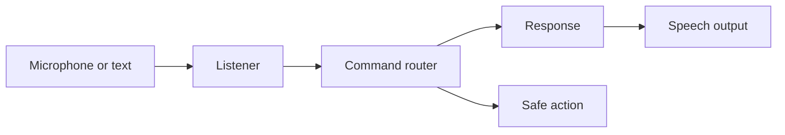

# MYA Voice Assistant

A modular Python voice assistant designed for reliable microphone input, clear command routing, and safe extension.

## Why this rebuild matters

The original prototype proved the interaction concept. This version separates audio I/O from intent handling so commands can be unit tested without a microphone or browser, calibrates ambient noise before listening, handles timeouts safely, and keeps runtime behavior configurable.

## Features

- Voice and keyboard modes
- Adaptive microphone energy threshold
- Ambient-noise calibration before capture
- Time, date, website, and web-search intents
- Dependency-injected browser actions for testing
- Graceful handling of silence and recognition failures
- Environment-based tuning
- Pytest coverage for routing behavior

## Architecture



## Setup

```bash
git clone https://github.com/Mirnamo/Voice_assistant.git
cd Voice_assistant
python -m venv .venv
# Windows: .venv\Scripts\activate
# macOS/Linux: source .venv/bin/activate
pip install -r requirements.txt
python -m mya.app
```

If PyAudio installation fails, install PortAudio for your operating system first.

## Keyboard demo

This mode works without a microphone:

```bash
python -m mya.app --text
python -m mya.app --text --once
```

## Tune recognition

Copy `.env.example` values into your shell or launch configuration:

- `MYA_AMBIENT_DURATION` — seconds used to measure room noise
- `MYA_LISTEN_TIMEOUT` — maximum wait for speech to begin
- `MYA_PHRASE_TIME_LIMIT` — maximum command duration
- `MYA_DYNAMIC_THRESHOLD` — enable adaptive energy thresholding
- `MYA_SPEECH_RATE` — text-to-speech words per minute

## Test

```bash
pip install -r requirements-dev.txt
pytest
ruff check .
```

## Roadmap

- Offline wake-word engine
- Local Llama-based intent fallback
- Per-user preference store
- Recognition telemetry without recording raw audio
- Pluggable skills with explicit permission controls

## Privacy

Audio is processed by the configured speech-recognition provider. Do not capture private conversations, and never store raw audio without clear consent.

## License

MIT
